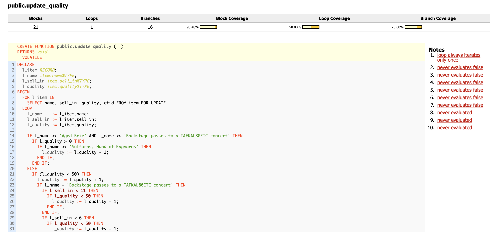

# Gilded Rose с PostgreSQL

## Описание

Эта реализация [Gilded Rose Refactoring Kata](https://github.com/emilybache/GildedRose-Refactoring-Kata) переносит логику управления товарами в PostgreSQL. Исходный код хранимой процедуры `update_quality` был адаптирован для совместимости с анализом покрытия кода в `piggly`. Проект включает поддержку Docker и PostgreSQL 17, а также юнит-тесты на `pgTAP` для проверки логики.

## Требования

- Docker и Docker Compose.
- Bash-терминал (на Windows используйте WSL или Git Bash).

## Технические требования «Gilded Rose»

- Все товары имеют `SellIn` (срок реализации, дни до продажи) и `Quality` (качество, ценность товара).
- В конце дня система снижает `SellIn` и `Quality` для каждого товара.
- После истечения срока продажи (`SellIn < 0`) качество ухудшается в два раза быстрее.
- Качество (`Quality`) никогда не бывает отрицательным и не превышает 50, кроме `Sulfuras` (качество 80, неизменно).
- **Aged Brie**: качество увеличивается с возрастом.
- **Backstage passes**: качество увеличивается на 1 (если `SellIn > 10`), на 2 (если `SellIn ≤ 10`), на 3 (если `SellIn ≤ 5`), но падает до 0 после концерта (`SellIn < 0`).
- **Sulfuras**: не требует продажи, качество не меняется.
- **Conjured** (зачарованные) товары: качество ухудшается в два раза быстрее обычных.
- Не изменяйте класс `Item` или свойства `Items`. Можно сделать метод `update_quality` статическим.

## Установка и запуск

1. Клонируйте репозиторий:
   ```bash
   git clone https://github.com/vasiliy-mikhailov/gilded-rose-postgresql
   cd gilded-rose-postgresql
   ```

2. Запустите проект:
   ```bash
   ./start.sh
   ```
   Скрипт запускает Docker-контейнер с PostgreSQL (имя: `gildedrose-db`) и открывает его терминал.

3. Выполните тесты:
   ```bash
   /tests/run_tests.sh
   ```
   Тесты на `pgTAP` проверяют процедуру `update_quality`. В консоли отобразятся результаты и покрытие кода от `piggly`.

4. Просмотрите отчет о покрытии:
   Откройте HTML-отчет:
   ```bash
   open ./piggly/reports/index.html
   ```
   На Linux используйте `xdg-open`. На Windows или если команда не работает, откройте файл `./piggly/reports/index.html` в браузере.

## Ожидаемые результаты

### Вывод тестов
После запуска `/tests/run_tests.sh` вы увидите результаты тестов `pgTAP`. Пример:
```
Running all pgTAP tests...
/tests/test_when_update_quality_for_aged_brie_then_quality_increases.sql ... ok
/tests/test_when_update_quality_for_any_item_then_quality_never_exceeds_50.sql ... ok
[...]
All tests successful.
Files=9, Tests=9,  0 wallclock secs
Result: PASS
```
Это подтверждает, что 9 тестов для процедуры `update_quality` прошли успешно.

### Отчет о покрытии
В `./piggly/reports/index.html` отображается анализ покрытия кода от `piggly`. Пример:
- Покрытие блоков: ~90% (большинство кода протестировано).
- Покрытие веток: ~75% (некоторые условия, например, для Aged Brie с отрицательным `sell_in`, не покрыты).
- Покрытие циклов: ~50% (цикл частично протестирован).

Отчет выделяет протестированные (зеленые) и непротестированные (красные) участки кода. Пример отчета:



## Особенности

- **Адаптация для `piggly`**: Код процедуры `update_quality` переработан для совместимости с анализом покрытия в `piggly`.
- **Docker и PostgreSQL 17**: Логика Gilded Rose реализована в хранимой процедуре с использованием PostgreSQL, запущенного в Docker.
- **pgTAP**: Юнит-тесты проверяют правила обновления качества товаров (Aged Brie, Backstage passes, Sulfuras и др.).

## Код для рефакторинга

Ниже приведен код хранимой процедуры `update_quality`, который нужно рефакторить:

```sql
CREATE OR REPLACE FUNCTION update_quality()
RETURNS void
LANGUAGE plpgsql
AS $$
DECLARE
  l_item RECORD;
  l_name item.name%TYPE;
  l_sell_in item.sell_in%TYPE;
  l_quality item.quality%TYPE;
BEGIN
  FOR l_item IN
    SELECT name, sell_in, quality, ctid FROM item FOR UPDATE
  LOOP
    l_name    := l_item.name;
    l_sell_in := l_item.sell_in;
    l_quality := l_item.quality;

    IF l_name <> 'Aged Brie' AND l_name <> 'Backstage passes to a TAFKAL80ETC concert' THEN
      IF l_quality > 0 THEN
        IF l_name <> 'Sulfuras, Hand of Ragnaros' THEN
          l_quality := l_quality - 1;
        END IF;
      END IF;
    ELSE
      IF (l_quality < 50) THEN
        l_quality := l_quality + 1;
        IF l_name = 'Backstage passes to a TAFKAL80ETC concert' THEN
          IF l_sell_in < 11 THEN
            IF l_quality < 50 THEN
              l_quality := l_quality + 1;
            END IF;
          END IF;
          IF l_sell_in < 6 THEN
            IF l_quality < 50 THEN
              l_quality := l_quality + 1;
            END IF;
          END IF;
        END IF;
      END IF;
    END IF;

    IF l_name <> 'Sulfuras, Hand of Ragnaros' THEN
      l_sell_in := l_sell_in - 1;
    END IF;

    IF l_sell_in < 0 THEN
      IF l_name <> 'Aged Brie' THEN
        IF l_name <> 'Backstage passes to a TAFKAL80ETC concert' THEN
          IF l_quality > 0 THEN
            IF l_name <> 'Sulfuras, Hand of Ragnaros' THEN
              l_quality := l_quality - 1;
            END IF;
          END IF;
        ELSE
          l_quality := 0;
        END IF;
      ELSE
        IF l_quality < 50 THEN
          l_quality := l_quality + 1;
        END IF;
      END IF;
    END IF;

    UPDATE item
      SET name = l_name, sell_in = l_sell_in, quality = l_quality
      WHERE ctid = l_item.ctid;
  END LOOP;
END;
$$;
```

## Пример теста

Ниже приведен пример теста на `pgTAP` для проверки увеличения качества `Aged Brie`:

```sql
BEGIN;
SELECT plan(1);

TRUNCATE TABLE item;
SELECT new_item('Aged Brie', 5, 10);

SELECT update_quality();

-- Качество должно увеличиться на 1
SELECT is(
    (SELECT quality::int FROM item LIMIT 1),
    11,
    'Aged Brie quality increases with age'
);

SELECT * FROM finish();
ROLLBACK;
```

## Устранение неполадок

- **Контейнер не запускается**: Убедитесь, что Docker установлен, и выполните:
  ```bash
  docker-compose down && docker-compose up -d
  ```
- **Терминал не открывается**: Войдите вручную:
  ```bash
  docker exec -it gildedrose-db bash
  ```
- **Ошибки тестов**: Проверьте, что файлы в `/src` и `/tests` корректно скопированы (см. `Dockerfile`).

## Вклад в проект

Хотите улучшить тесты или код? Создайте pull request или сообщите об ошибке в [issues](https://github.com/vasiliy-mikhailov/gilded-rose-postgresql/issues).